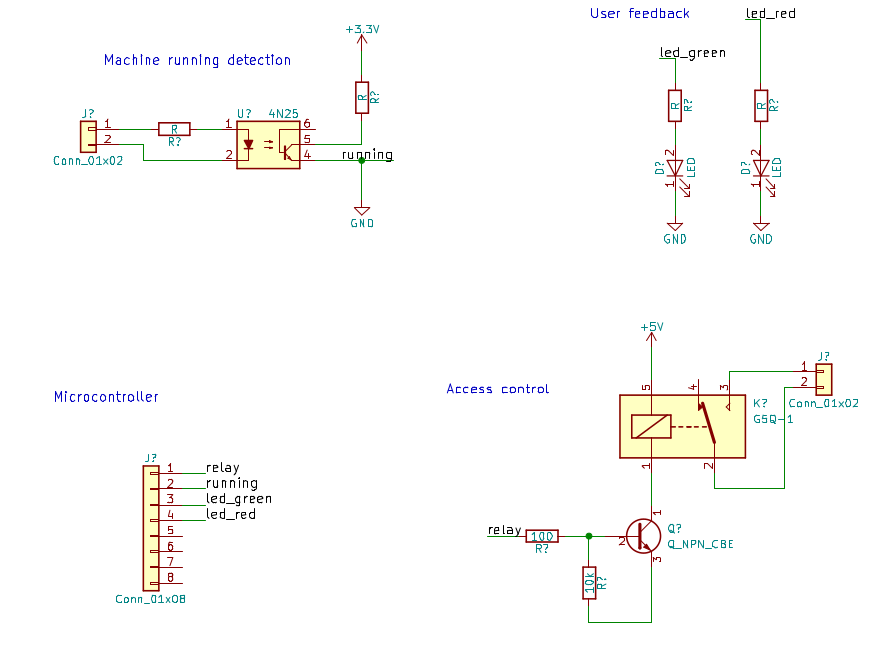

# Machine access

Device for controlling access to dangerous and expensive machines, like lasercutter and CNC.

The device exposes an MQTT-based protocol for controlling and sending status.
The client that reads/sends the MQTT messages is responsible for providing a user interface,
authentication and checking whether the user is permitted to unlock.
At Bitraf we use [p2k16](https://github.com/bitraf/p2k16) for this.

## Electronics

## Firmware

`TODO`

## Protocol

Device subscribes to these MQTT topics

   $prefix/$devicename/unlock   bool  true  # unlock machine, can now run
   $prefix/$devicename/lock     bool  true  # lock machine, can not run

Device sends on these MQTT topics

   $prefix/$devicename/error     string "errormessage" # error occurred for lock/unlock command
   $prefix/$devicename/islocked  bool   true|false     # whether machine is locked or not
   $prefix/$devicename/isrunning bool   true|false     # machine is actively running or not

Example $prefix is `bitraf/machine` and $devicename `bluelaser`.
